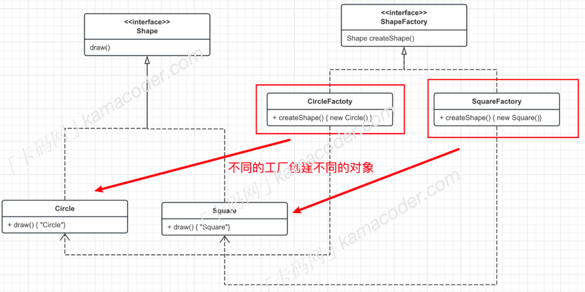

简单工厂类简化了客户端操作，客户端可以调用工厂方法来获取具体产品，而无需直接与具体产品类交互，降低了耦合，但是有一个很大的问题就是不够灵活，如果需要添加新的产品，就需要修改工厂类的代码。

### 什么是工厂方法模式

工厂方法模式也是一种创建型设计模式，简单工厂模式只有一个工厂类，负责创建所有产品，如果要添加新的产品，通常需要修改工厂类的代码。而工厂方法模式引入了抽象工厂和具体工厂的概念，每个具体工厂只负责创建一个具体产品，添加新的产品只需要添加新的工厂类而无需修改原来的代码，这样就使得产品的生产更加灵活，支持扩展，符合开闭原则。

工厂方法模式分为以下几个角色：

- 抽象工厂：一个接口，包含一个抽象的工厂方法（用于创建产品对象）。
- 具体工厂：实现抽象工厂接口，创建具体的产品。
- 抽象产品：定义产品的接口。
- 具体产品：实现抽象产品接口，是工厂创建的对象。

> 实际上工厂方法模式也很好理解，就拿“手机Phone”这个产品举例，手机是一个抽象产品，小米手机、华为手机、苹果手机是具体的产品实现，而不同品牌的手机在各自的生产厂家生产。



```c
#include <iostream>
#include <vector>
 
// 抽象积木接口
class Block {
public:
    virtual void produce() = 0;
};
 
// 具体圆形积木实现
class CircleBlock : public Block {
public:
    void produce() override {
        std::cout << "Circle Block" << std::endl;
    }
};
 
// 具体方形积木实现
class SquareBlock : public Block {
public:
    void produce() override {
        std::cout << "Square Block" << std::endl;
    }
};
 
// 抽象积木工厂接口
class BlockFactory {
public:
    virtual Block* createBlock() = 0;
};
 
// 具体圆形积木工厂实现
class CircleBlockFactory : public BlockFactory {
public:
    Block* createBlock() override {
        return new CircleBlock();
    }
};
 
// 具体方形积木工厂实现
class SquareBlockFactory : public BlockFactory {
public:
    Block* createBlock() override {
        return new SquareBlock();
    }
};
 
// 积木工厂系统
class BlockFactorySystem {
private:
    std::vector<Block*> blocks;
 
public:
    void produceBlocks(BlockFactory* factory, int quantity) {
        for (int i = 0; i < quantity; i++) {
            Block* block = factory->createBlock();
            blocks.push_back(block);
            block->produce();
        }
    }
 
    const std::vector<Block*>& getBlocks() const {
        return blocks;
    }
 
    ~BlockFactorySystem() {
        // 释放所有动态分配的积木对象
        for (Block* block : blocks) {
            delete block;
        }
    }
};
 
int main() {
    // 创建积木工厂系统
    BlockFactorySystem factorySystem;
 
    // 读取生产次数
    int productionCount;
    std::cin >> productionCount;
 
    // 读取每次生产的积木类型和数量
    for (int i = 0; i < productionCount; i++) {
        std::string blockType;
        int quantity;
        std::cin >> blockType >> quantity;
 
        if (blockType == "Circle") {
            factorySystem.produceBlocks(new CircleBlockFactory(), quantity);
        } else if (blockType == "Square") {
            factorySystem.produceBlocks(new SquareBlockFactory(), quantity);
        }
    }
 
    return 0;
}
```

